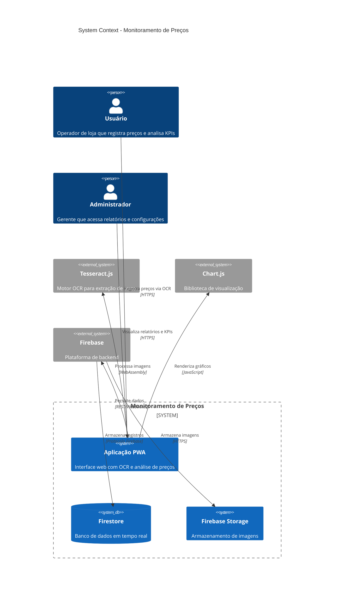
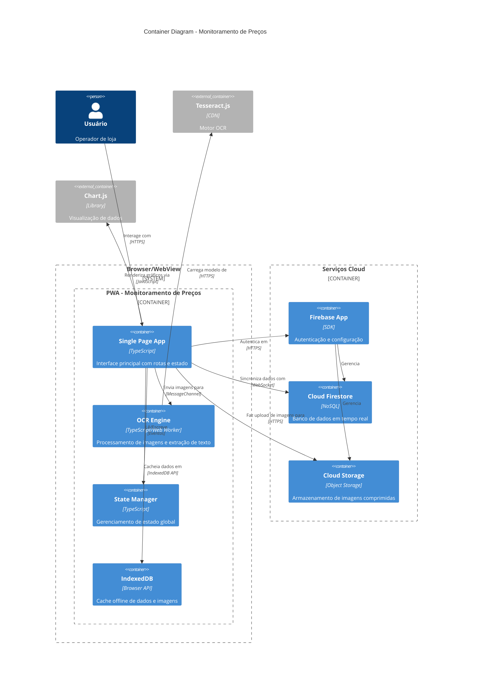
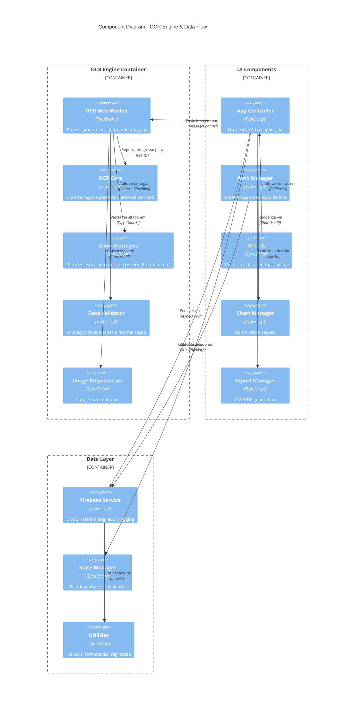

# C4 Architecture Documentation

## Monitoramento de Preços - Sistema de OCR e Análise

**Data**: 2026-04-21  
**Versão**: 1.0.0  
**Autor**: Sistema Autônomo de Documentação

---

## Nível 1: Contexto (System Context)



### Escopo do Sistema

O sistema é uma **PWA (Progressive Web App)** para monitoramento de preços em redes varejistas, com as seguintes capacidades:

- **OCR Inteligente**: Extração de dados de etiquetas usando Tesseract.js
- **Análise em Tempo Real**: KPIs e gráficos atualizados instantaneamente
- **Persistência Firebase**: Dados sincronizados na nuvem com cache offline
- **Exportação**: Relatórios em CSV e PDF
- **Segurança**: Rate limiting, audit logging, CSP headers

---

## Nível 2: Container (Containers)



### Containers Principais

| Container | Tecnologia | Responsabilidade |
|-----------|------------|------------------|
| **SPA** | TypeScript/Vanilla JS | Interface do usuário, formulários, tabelas, dashboards |
| **OCR Engine** | TypeScript + Tesseract.js | Extração de texto de imagens, normalização, validação |
| **State Manager** | TypeScript | Estado global, persistência local, sincronização |
| **IndexedDB** | Browser API | Cache offline, fila de sincronização |
| **Firebase Services** | SDK Firebase | Backend-as-a-Service, auth, database, storage |

---

## Nível 3: Componentes (Components)



### Componentes Principais

| Componente | Arquivo | Responsabilidade |
|------------|---------|------------------|
| **App Controller** | `src/app.ts` | Orquestração principal, tabela, KPIs, filtros |
| **Auth Manager** | `src/auth.ts` | Senhas por loja, hash SHA-256, seleção |
| **Firebase Service** | `src/firebase.ts` | Firestore, Storage, rate limiting, audit |
| **OCR Core** | `src/ocr/core.ts` | Gerenciamento de workers Tesseract |
| **OCR Engine** | `src/ocr/ocr.ts` | Lógica principal de extração (1000+ linhas) |
| **Store Strategies** | `src/ocr/strategies/*.ts` | Padrões específicos por rede varejista |
| **Data Validator** | `src/ocr/core.ts` | Validação e normalização de dados extraídos |
| **State Manager** | `src/state.ts` | Estado global reativo |
| **UI Utils** | `src/ui.ts` | Feedback visual, toasts, relógio |
| **Chart Manager** | `src/charts.ts` | Gráficos e indicadores |
| **Export Manager** | `src/export.ts` | Geração de relatórios |

---

## Nível 4: Código (Code)

### Estrutura de Diretórios

```
src/
├── app.ts                 # Controlador principal
├── auth.ts                # Autenticação
├── firebase.ts            # Serviço Firebase (secure)
├── state.ts               # Estado global
├── ui.ts                  # Utilitários UI
├── charts.ts              # Visualização
├── export.ts              # Exportação
├── utils.ts               # Helpers
├── keys.ts                # Atalhos de teclado
├── ocr/
│   ├── core.ts            # Gerenciamento Tesseract
│   ├── ocr.ts             # Engine principal
│   └── strategies/        # Estratégias por loja
│       ├── base.ts        # Normalização base
│       ├── honor.ts       # Lojas Honor
│       └── ...            # Outras redes
└── workers/               # Web Workers (futuro)
    └── ocr.worker.ts      # OCR em background
```

### Fluxo de Dados - OCR

```
┌─────────────┐     ┌──────────────┐     ┌─────────────┐
│   Imagem    │────▶│ Preprocessor │────▶│ Tesseract.js│
│   (Base64)  │     │ (Crop/Resize)│     │  (Worker)   │
└─────────────┘     └──────────────┘     └──────┬──────┘
                                                  │
                         ┌────────────────────────┘
                         ▼
┌─────────────┐     ┌──────────────┐     ┌─────────────┐
│   Dados     │◀────│  Strategies  │◀────│   Raw Text  │
│  Validados  │     │(Store Rules) │     │  (OCR Out)  │
└──────┬──────┘     └──────────────┘     └─────────────┘
       │
       ▼
┌─────────────┐     ┌──────────────┐
│   Firebase  │◀────│   State      │
│  Firestore  │     │   Manager    │
└─────────────┘     └──────────────┘
```

### Padrões de Segurança

| Camada | Implementação |
|--------|---------------|
| **Configuração** | Variáveis de ambiente (.env) |
| **Rate Limiting** | 100 requisições/minuto por operação |
| **Audit Logging** | Registro de todas as operações CRUD |
| **CSP** | Headers restritivos em vite.config.ts |
| **HSTS** | HTTPS obrigatório |
| **XSS Protection** | Sanitização de inputs |

### Decisões Técnicas

| Decisão | Justificativa |
|---------|---------------|
| **Tesseract.js** | OCR client-side, sem envio de imagens para servidores |
| **Firebase** | Real-time sync, offline persistence, hosting |
| **PWA** | Funciona offline, instalável, atualizações automáticas |
| **TypeScript Strict** | Type safety, detecção de erros em build time |
| **Web Workers** | OCR não bloqueia UI thread |
| **Virtual Scrolling** | Performance com milhares de registros |

---

## Mapeamento de Qualidade

### KPIs de Código

| Métrica | Valor Atual | Target | Status |
|---------|-------------|--------|--------|
| **Type Coverage** | 60% | 95% | 🔴 |
| **Test Coverage** | 5% | 80% | 🔴 |
| **Security Score** | 3/5 | 5/5 | 🟡 |
| **Performance** | 3/5 | 5/5 | 🟡 |
| **Maintainability** | 2/5 | 5/5 | 🔴 |

### Próximas Iterações

1. **Agente #2**: Testes (80%+ coverage), zero `any`, strict types
2. **Agente #3**: Web Workers para OCR, Virtual Scrolling, Code Splitting

---

## Apêndice

### Tecnologias

- **Frontend**: TypeScript 5.x, Chart.js 4.x
- **OCR**: Tesseract.js 6.x
- **Backend**: Firebase (Firestore, Storage, Auth)
- **Build**: Vite 6.x
- **Testes**: Vitest + Playwright (pending)
- **PWA**: Vite PWA Plugin

### Padrões de Código

- **ESLint**: Configuração strict
- **Prettier**: Formatação automática
- **Conventional Commits**: Padrão de mensagens
- **SOLID**: Princípios de design
- **Clean Architecture**: Separação de concerns

---

*Documentação gerada automaticamente pelo sistema C4.*
*Para atualizações, execute: `skill c4-architecture-c4-architecture`*
